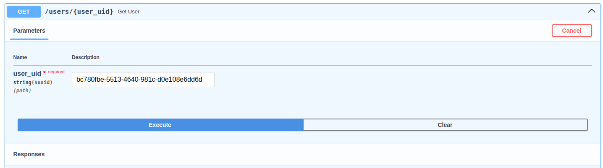

# Patron Criteria

---

This is a basic code implementation of Patron Criteria
Full code example on [github alec-ibp](https://github.com/alec-ibp/patron-criteria).

---

Patron criteria drive the development process based on the needs, preferences, and constraints of the stakeholders or users. These criteria help ensure that the software meets the expectations and objectives of those who will ultimately use or benefit from it. Developers can create software that effectively addresses the specific needs and priorities of the intended audience.

In short words the patron criteria help us to build an scalable an maintainable filter, the Criteria can hold several filters and apply them in a single way.

Working with clean architectures, if our business logic allow the user to filter a Model by many attributes, may the first thought will be implement a number of interfaces covering all the possible combination of filters. But this is not an scalable design.

With the Patron Criteria we can get all the incoming filter rules an stored them in one class Criteria, so now we only have one interface called `search_by_criteria` and the implementation of the function gonna decompose the criteria an apply all the incoming filters.

## **API Endpoints**

**search by uid**: <a href="http://0.0.0.0:9090/users/{user_uid}" target="_blank">http://0.0.0.0:9090/users/{user_uid}</a>

**search by criteria**: <a href="http://0.0.0.0:9090/users/?query_params" target="_blank">http://0.0.0.0:9090/users/</a>

## **Criteria implementation**

We can define 'n' number of query params and the criteria gonna handle all of them in one single class.

---
